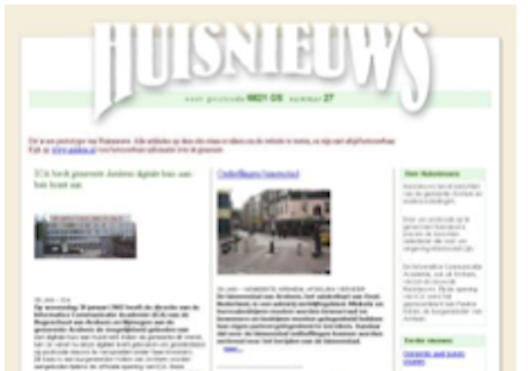

# Huisnieuws

Het idee achter Huisnieuws is dat een bewoner ‘op maat gemaakt’ nieuws krijgt aan de hand van zijn adres. Door het selecteeren van een postcode locatie worden items geselecteerd en getoond die specifiek van toepassing zijn op de leefomgeving van de gebruiker.

Een wegwerkzaamheid aan de weg wordt alleen getoond aan bewoners van die specifieke straat, buurtfeesten worden automatisch gezien door iedereen in de wijk, ophaaldata van oud papier kunnen per gebied getoond worden, etc...

Veel instellingen en bedrijven zoeken naar middelen om specifieke geografische doelgroepen te benaderen. Meestal gebeurt dit door middel van huis-aan-huis media of direct mail. Deze oplossingen zijn echter duur en missen de precisie om bijvoorbeeld één straat te benaderen. Huisnieuws maakt het mogelijk om op postcodeniveau berichten te plaatsen.

`figuur 1.` _Huisnieuws, 2002._ [(bron)](huisnieuws_image.png)

## Opdracht

Er moet een web applicatie worden gerealiseerd waarin een gebruiker op basis van zijn postcode 'op maat gemaakt' nieuws te zien krijgt. Daarnaast moet er een beheeromgeving worden gerealiseerd waarin nieuws eenvoudig op basis van postcode locaties gerubriceerd kan worden. Ook moeten items gemakkelijk van een (multi-level) tag kunnen worden voorzien.

Als de basis eenmaal staat kunnen we uitbreidingen toevoegen zoals meer sociale interactie met reacties, geverifieerde bewoners, buurt gerelateerde zaken, bbq's, wijkvergaderingen, AED's, aangeboden/gezocht, dating, preventie, etc. Denk dan meer aan websites zoals [Nextdoor](https://nextdoor.nl/).

Belangrijk tijdens de gehele opdracht is dat het eindresultaat zeer gebruiksvriendelijk is voor iedereen en daarmee dus ook [toegankelijk voor iedereen](https://www.w3.org/WAI/fundamentals/accessibility-intro/).

## Uitbreidingen

Binnen de opdracht zijn er nog veel onderwerpen niet vastgelegd en/of onduidelijk. Via korte onderzoekjes kan nagedacht worden over:

- _Hoe wordt locatie gebaseerde informatie handig opgeslagen?_
  Welke mogelijkheden heeft MongoDB hiervoor? Op basis van postcode of [lat/long](https://www.maptools.com/tutorials/lat_lon/formats)?

- _Hoe worden (meerdere) postcodes en gebieden daarvan (straat, wijk, buurt, etc.) handig ingevoerd?_
  Kan dit via (opensource) kaarten à la Google Maps? Kun je dan ge'hightlight' zweven over postcodes en slim de radius vergroten en verkleinen? Of kun je juist paden creëren voor de aankomende werkzaamheden, optochten of de avondvierdaagse?

- _Hoe en wat is een multi-level tag systeem?_
  In een standaard tagging systeem bestaat een 'tag' slechts eenmalig. Wat als je nu dezelfde 'tag' in meerdere hiërarchieën laat bestaan?

- _Hoe kunnen we commerciële toevoegingen maken zonder de privacy van de gebruiker te schenden?_

- _Wat, wie, waar en hoe moeten we content opslaan?_
  Zeker in het geval van commerciële diensten en uitbreidingen naar sociale interacties; waar worden de buurt BBQ foto's opgeslagen?

- _Integratie met andere diensten_
  Bijvoorbeeld [thuisbezorgd](https://www.thuisbezorgd.nl/), [deliveroo](https://deliveroo.nl/nl/), [nu.nl](https://www.nu.nl/), [reclamefolder](https://www.reclamefolder.nl/), etc.

- _Realiseren van een 'native' mobiele app._
  Bijvoorbeeld mbv [react native](https://reactnative.dev/).

- _Kan dit een platform zijn waarbinnen andere applicatie draaien?_
  Bijvoorbeeld [Microsoft 365](https://developer.microsoft.com/en-us/microsoft-365), [Visual Studio Code](https://code.visualstudio.com/api) of [Chrome Extensions](https://developer.chrome.com/docs/extensions/).

## Back in the old days

De opdrachtgever van deze opdracht is Deny (oud directeeur van ICA / AIM) en Sander is de product owner (by proxy). Samen met Robert heeft dit drietal al een keer een prototype gemaakt van dit idee.
Zie hiervoor deze [flyer](huisnieuws_informatie.pdf).

> Let wel: dit was een prototype gemaakt in een avond en nacht in 2002 😅
