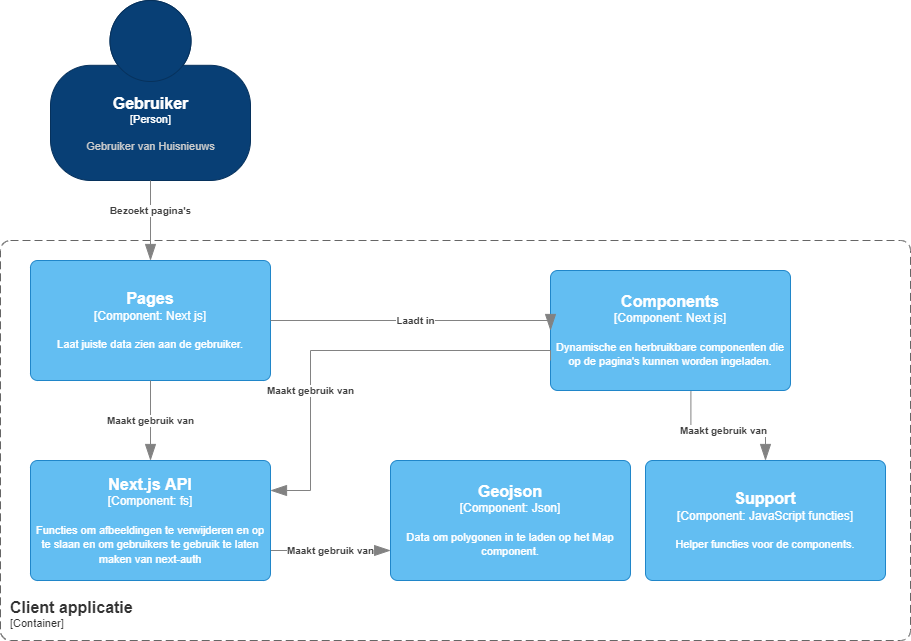

# Software Guidebook Huisnieuws

# Context

## Context diagram


Hierboven zie je het context diagram van Huisnieuws. Hierbij horen 3 soorten gebruikers: bezoekers, users en posters. Bezoekers kunnen een postcode invullen en op basis daarvan een lijst van artikelen te zien krijgen. Users zijn ingelogd op Huisnieuws maar kunnen nog geen nieuws posten. Posters zijn geverifieerd door Huisnieuws en kunnen artikelen plaatsen voor een opgegeven postcode en hun eigen artikelen beheren(bewerken en verwijderen).

Dit is het software guidebook voor Huisnieuws, een website voor lokaal nieuws. Op huisnieuws is het mogelijk om lokaal nieuws te zien op basis van een opgegeven postcode en een radius. Het nieuws wordt geplaatst door geverifieerde bedrijven uit de buurt.

Het idee is gebaseerd op een app die in 2002 is ontwikkeld voor Arnhem als cadeau. Deze originele website is niet meer online maar hier moet een nieuwe versie van komen. We. beginnen helemaal opnieuw met de ontwikkeling. Hierdoor hoeven we geen rekening te houden met een bestaande omgeving.

De doelgroep van de website zijn volwassenen boven de 30 die op zichzelf wonen. Dit zijn mensen die graag meer lokaal nieuws willen in tegenstelling tot landelijk nieuws. Ook heeft de website als doelgroep adverteerders, die graag lokaal mensen willen bereiken met hun advertenties. Dit kunnen ze momenteel lastig doen en ze hebben graag een plek waar dit gemakkelijk kan.

# Functional Overview
[Issue board](https://github.com/HANICA-DWA/sep2021-project-numbat/issues)

## Login

De login functionaliteit werkt via OAuth. Je kan inloggen met een Google account.

## Artikelen inzien en lezen

Het doel voor de gebruikers is om relevante artikelen te lezen en te vinden. Dit wordt gedaan door een gebruiker een feed te tonen waarin de gebruiker relevante content op basis van zijn/haar locatie ziet. Het doel hierbij is dan ook om dit zo nauwkeurig mogelijk te kunnen tonen. Ook moet de gebruiker vanuit deze feed gemakkelijk naar een detailpagina kunnen navigeren om de hele content van een artikel te kunnen lezen.

## Zoeken

Zoeken werkt op basis van een postcode. Er worden artikelen opgehaald die zijn gekoppeld aan de opgegeven postcode. Ook kan een bereik worden aangegeven met een slider. Het bereik bepaalt vanaf welke radius je artikelen te zien krijgt. Zo kan je alleen artikelen van je straat zien maar ook die van je stad.

## Artikel aanmaken

Een geverifieerd bedrijf kan artikelen plaatsen. Voor een artikel is een thumbnail, titel, tekst en postcode nodig. De postcode wordt gecontroleerd. Zo voorkom je dat er artikelen worden gekoppeld aan niet bestaande postcodes.

## Artikel bewerken

De poster kan zijn eigen artikelen bewerken.

## Kaart

Er is een kaart staat de omgeving van de zoekopdracht aangegeven. Het aangegeven gebied wordt aangepast op basis van het bereik.

## Rollen systeem

Met behulp van rollen in de database worden users gelimiteerd tot bepaalde delen van de site. Deze check wordt met middleware gedaan.

## Deelbare links

De links zijn zo opgesteld dat ze er leesbaar uit zien waardoor ze gemakkelijk te delen zijn.

( /artikelen/:id/:slug) 

# Quality Attributes

## Performance

- ServerSideProps gebruiken in Next.js. Hiermee kunnen we data inladen vanaf de node.js omgeving waardoor de pagina sneller laad.
- Geojson data voor de kaart wordt met "lazy loading" ingeladen. De kaart vereist veel data voor het aangeven van de geselecteerde postcode. Deze data wordt "lazy" ingeladen zodat niet de gehele website hier op hoeft te wachten. Omdat we onze eigen geojson data gebruiken is het voor de performance het beste om de map ook "lazy" in te laden. Zie hieronder hoe we dat doen.

```jsx
const Map = dynamic(() => import('../Map/Map'));
```

## Reusability

We werken met componenten waardoor we niet dubbele code hoeven te schrijven.

## Security

We gebruiken OAuth voor het inloggen waardoor we geen gevoelige informatie zelf hoeven op te slaan.

We gebruiken Middleware om aanvragen te verifiëren en tegen te houden als dit nodig is.

## Availability

Als de webserver crashed dan kan deze automatisch de scripts opnieuw opstarten.

## Testing

Als developer hebben we de node modules geinstalleerd, en runnen op onze lokale machine de test suites, deze bedekken zo goed als de gehele gebruikers interface, bijvoorbeeld word er getest op het inloggen met een google account via oauth. Met testen willen wij als developer de kwaliteit van de gebruikers ervaring en de voorspelbaarheid van de code omhoog brengen.

Ook worden er verschillende tests op de continuous integration suite op Github gerunt bij alle commits in de main branch en alle pull requests. Dit zijn alle tests met uitzondering van de end-to-end tests omdat deze lastig uit te voeren zijn in deze virtuele server.

### Test packages:

Voor de unit tests gebruiken we Jest. En voor de end-to-end tests gebruiken we Puppeteer, een chromium emulator om de browser te mocken.

De test suites start je met de volgende comando’s:

```bash
# run de unit tests:
npm run test

# run de end-to-end tests:
npm run test:e2e
```

# Constraints

## Technieken

We hebben met de PO afgesproken om met de volgende technieken te gaan werken:

- React (Next.js)
- Node.js
- Express
- MongoDB (Mongoose)
- TailwindCSS

## Deployment

Het project moet als website beschikbaar zijn voor zowel desktop als mobile toestellen.

## REST

De API is volgens REST opgezet. Door volgens deze manier te werken zijn de endpoints voorspelbaar.

## Code reviews

Om de kwaliteit hoog te houden stellen we een aantal eisen aan onze development omgeving en in onze werking met git. Binnen de code werken we met EsLint. Hierdoor werkt iedereen binnen het team volgens hetzelfde code formaat. Tijdens een pull request wordt hier ook automatisch op getest via GitHub Actions.

Verder hebben we handmatige reviews voor elke Pull Request. Voordat code naar de main branch mag gaan moet er een merge request worden aangemaakt. Deze wordt door een ander persoon binnen het team gereviewd en getest.

## Kaart data

We hebben maar een gelimiteerde dataset voor het tonen van de huidige locatie op de kaart. Hierdoor kunnen we niet in veel detail de locatie of radius laten zien van een zoekopdracht. De data die we wel hebben is: geojson data van alle steden en dorpen in Nederland en geojson data van wijken in de omgeving Den Haag.

# Principles

## DRY (don’t repeat yourself)

Om te voorkomen dat we dubbele code hebben werken we zo veel mogelijk met herbruikbare components. Next.js is gemaakt met React en bied daarom de mogelijkheid om te werken met React components.

## Use of interfaces

We werken met interfaces voor requests zodat je type hinting krijgt in de editor. Hierdoor weet je precies wat voor data je kan verwachten.

## Error handling

Om run time errors te voorkomen maken we gebruik van try catch. Als het request fout gaat kan je de foutmelding uitlezen en crasht het programma niet. Ook geven we response codes mee voor extra informatie. Error’s worden teruggestuurd naar de client als het relevant is. Maar er is geen logging dienst gebruikt.

We zouden dit kunnen verbeteren door de error’s naar een logging service te sturen. Dit is aan te raden om toe te voegen voordat de applicatie live gaat, maar valt buiten de scope van dit project.

# Software Architecture

## Container diagram


Hierboven zie je het container diagram van Huisnieuws. De gebruiker maakt alleen gebruik van de Web Application. Die laat de juiste data zien door API calls te maken naar de server en door calls te maken naar de Next.js API. De Next.js API zorgt ervoor dat de juiste front-end aan de gebruiker wordt getoond en zorgt voor de communicatie tussen de client en het filesystem. De server verbindt de Web Application met de database. De sever maakt ook gebruik van een externe Postcode API, deze API kan postcodes omzetten in coördinaten en checkt of postcodes echt bestaan. 

## Component diagram (level 3)

### Server applicatie (Express)


De API applicatie is gemaakt met Express. Een request van de web application komt eerst binnen in de routes. Bepaalde beveiligde routes worden door de middleware gecontroleerd. Zo kunnen we er zeker van zijn dan alle waardes in de database kloppen. Nadat deze waarde zijn gecontroleerd wordt een functie in een controller aangeroepen. Deze functie verwerkt en formatteert de aanvraag en stuurt dit via mongoose naar de database. Deze controllers zijn eigenlijk model methodes i.p.v. services.

### Client applicatie



De client side applicatie is gemaakt met Next.js. Het handige aan Next.js is dat de folderstructuur in het component pages tegelijk ook de routing voor de pagina's afhandelt. Het verwarrende is alleen dat de next API in pages staat, dit zijn geen pagina’s maar API endpoints. In het pages component wordt gebruikt gemaakt van components. Dit zijn dynamische en herbruikbare componenten. De components maken weer gebruik van support en ook van de next API. Support zijn helper functies voor de components. In het component next API zitten functies om afbeeldingen te verwijderen of te uploaden op het filesystem en functies om geojson data op te halen. Calls naar de next API wordt gedaan door HTTP request. Geojson wordt gebruikt om op de kaart polygonen weer te geven. Daarmee wordt het geselecteerde gebied aangegeven. 

# External Interfaces

### Postcode api

De postcode API van openstreetmap is een API die verschillende data teruggeeft, aan de hand van deze data kunnen we dan checken of een postcode bestaat door te kijken of er wel data terugkomt, en of deze data de juiste types bevat.

En we kunnen de latitude en longitude ophalen van een postcode om deze weer te geven op de Mapbox kaart die later in deze guidebook word uitgelegd.

Met deze externe API hebben wij een tweetal middleware functies gemaakt: 1 voor het checken of de postcode bestaat, de 2e voor het ophalen van de lat & long zoals boven vermeld.

# Code

## Postcode omzetten naar gps coördinaten

Als de gebruiker een postcode invult wordt er op de kaart een marker neergezet op de coördinaten die bij dit postcode horen. Om dit te realiseren wordt er een call naar de express API gemaakt. De router die bij deze call hoort checkt eerst via middleware of dit postcode bestaat. Als het opgegeven postcode bestaat wordt er een call gemaakt naar een externe API [voorbeeld API call](https://nominatim.openstreetmap.org/search.php?q=6826CC%20nederland&format=jsonv2).  Het resultaat van deze call bevat onder andere de latitude en longitude die bij de postcode horen. Deze data wordt geretourneerd en wordt daarna verwerkt in de kaart.

## Server side rendering

Het framework dat wij gebruiken (Next.js) biedt de optie om al voordat React ingeladen is en gemount is in de node omgeving data te fetchen en dit in de pagina props te stoppen. Dit doen we door gebruik te maken van de getServerSideProps() functie binnen Next JS. Zie hieronder een simpel voorbeeld van hoe dit gebruikt kan worden om data te injecten.

```jsx
function Page({ data }) {
  // Render data...
}

// This gets called on every request
export async function getServerSideProps() {
  // Fetch data from external API
  const res = await fetch(`https://.../data`)
  const data = await res.json()

  // Pass data to the page via props
  return { props: { data } }
}

export default Page
```

In dit voorbeeld is Page het React component (wat de gebruiker krijgt op een bepaalde URL) en de getServerSideProps de methode die in de Node omgeving uitgevoerd wordt.

## Routing

In de Next.js applicatie wordt er doormiddel van de mappenstructuur client side en API routing ingesteld. Dit gebeurt vanuit de `/pages` directory. Hierbinnen betekenen alle folders en bestanden de routes die uiteindelijk door Next.js opgesteld worden. Voor meer informatie over hoe Next.js dit regelt zie hier documentatie [Documentatie routing in Next.js]([https://nextjs.org/docs/routing/introduction](https://nextjs.org/docs/routing/introduction).

# Data

De data staat in een MongoDB Database. We gebruiken daar op dit moment de officiele mongo image voor in een docker container.

De data schaalt met de hoeveelheid gebruikers. Voor development en voor een demo is er maar een zeer kleine database nodig en zal dit geen probleem vormen. Als de applicatie in productie wordt genomen moet de opslag in de gaten worden gehouden om te bepalen of er een grotere database nodig is. Maar dit valt voor nu buiten de scope van ons project.

De structuur van onze database wordt behouden door gebruik te maken van models met de hulp van Mongoose. In deze models staat de structuur van de verschillende documenten. Deze modellen zijn hier terug te vinden:
[https://github.com/HANICA-DWA/sep2021-project-numbat/tree/main/server/src/database/models](https://github.com/HANICA-DWA/sep2021-project-numbat/tree/main/server/src/database/models)

### Geojson data

Op de kaart laten we steden en wijken zien met behulp van geojson data. Deze data staat lokaal opgeslagen in het project. We hebben deze data van [overpass turbo](http://overpass-turbo.eu/) gehaald. Met overpass turbo kan je via een query allerlei geojson data over de wereld ophalen. Zie hieronder een voorbeeld van een query hoe je van alle steden en dorpen in Utrecht data kunt ophalen.


# Infrastructure Architecture


Hierboven zie je het Infrastructure Architecture diagram van Huisnieuws. Er zijn een aantal interne systemen die door Huisnieuws zelf onderhouden moeten worden.  Als de vps crashed dan kan je een nieuwe server aanvragen bij de krachtcentrale, dit duurt ongeveer 3-5 dagen. Vercel host de next applicatie.

# Deployment

## Requirements

- Node.js versie 14 of hoger geïnstalleerd.
- Docker

## Meewerken aan het project.

Onderstaande stappen zijn een opzet voor het live zetten van de development applicaties. Om dit succesvol te runnen heb je een Node versie van minimaal 16 nodig een npm geinstalleerd hebben.

## Clone de Github repository, en ga naar de folder in je terminal

```bash
git clone git@github.com:HANICA-DWA/sep2021-project-numbat.git
cd sep2021-project-numbat
```

### Kopieer `.env.local.example` in client folder en plak deze met de naam `.env.local`

```bash
# Voor Mac en Linux gebruikers
cd ../client
cp .env.local.example .env.local

# Voor windows
cd ../client
copy .env.local.example .env.local
```

Vul dit bestand aan met de volgende gegevens:

- `GOOGLE_CLIENT_ID` Keys van Google API voor OAuth
(Zie deze link: [https://support.google.com/cloud/answer/6158849?hl=en](https://support.google.com/cloud/answer/6158849?hl=en)
- `GOOGLE_CLIENT_SECRET` Keys van Google API voor OAuth
(Zie deze link: [https://support.google.com/cloud/answer/6158849?hl=en](https://support.google.com/cloud/answer/6158849?hl=en)
- *`NEXT_PUBLIC_MAPBOX_API_ACCESS_TOKEN` API key* voor de kaart.
    - Zie deze links: [How to use mapbox](https://docs.mapbox.com/help/getting-started/#how-to-use-mapbox), [Mapbox Glossary (Access token)](https://docs.mapbox.com/help/glossary/access-token/)
- *`GOOGLE_USER_EMAIL` Gmail account voor OAuth e2e tests.*
- *`GOOGLE_USER_PASSWORD` Gmail account voor OAuth e2e tests.*

### Zet de omgeving klaar en run de apps

Installeer de benodigde packages, run de seeder van de database en run de development apps. in dit geval de Next.js app en de Express API.

```bash
# Development

# Open een terminal om de Next.js app starten in dev-mode.
cd huisnieuws
cd client
npm i
npm run dev

# Open een terminal om de Express API en database te starten.
docker-compose up -d

# Seed de database
# Open eerst een terminal session van de numbat-express container.
npm run seed # Binnen de container

```

### Bekijk de applicatie

Als alle stappen zijn doorlopen, staat er een Huisnieuws applicatie klaar op de URL: `http://localhost:8080`.

Je ziet dan de client app:


### Acties

In de testdata wordt de volgende postcode gebruikt: 2587GA**.**
Deze postcode kan je gebruiken om te zoeken naar artikelen.

Je kan inloggen door rechtsboven in de navbar op inloggen te drukken. Daar moet je inloggen met een google account wat is toegevoegd als test user aan je Google API.

### Tests

Je kan de volgende commando’s gebruiken om de unit tests uit te voeren.

```bash
# unit tests
cd ./client
npm run test

# Open een terminal van de numbat-express docker omgeving.
npm run test # Binnen de docker omgeving.

```

**Voor de e2e tests moet je eerst de dev server van zowel de client als de server starten.**

```bash
# Start client en server
cd ./client
npm run dev

# Start de server met docker
docker-compose up -d

# start de e2e tests.
cd ./client
npm run test:e2e
```

### Deployment

Als je build-ready varianten van de beide applicaties wilt genereren zijn hier speciale commands voor. Hieronder staat beschreven hoe je dit doet.

```bash
# Open een terminal om de Next.js app builden.
cd client
npm i
npm run build # Maakt en productie build in de .next folder.
npm run start # Start de Next.js app in production mode.

# Open een terminal om de Express api en database starten.
docker-compose up -d
```

# Operation and Support

## Logging

De console.log in de code is terug te zien in de terminal op de server.

Voor een toekomstige versie of als de applicatie naar productie gaat is het aan te raden om een externe dienst te gebruiken voor het bijhouden van deze logs. Zo kan er gemakkelijker worden bijgehouden of er problemen zijn.

## Monitoring

### Docker

We kunnen met docker stats de performance van een container inzien.


### VPS

Binnen het interface van Argo ICT kunnen we ook de performance van de VPS inzien. Hier zien we het totale verbruik van cpu, memory en networking van de gehele VPS. Deze informatie kan je gebruiken om bij te houden of de VPS geschikt is om de applicatie te runnen.


## Configuratie aanpassingen

### Omgevingsvariabelen

Als het .env bestand wordt aangepast moeten de node scripts worden herstart.

### Wat te doen bij een crash of herstart

De Express en MongoDB containers hebben in docker-compose staan dat ze altijd proberen te herstarten. Dit werkt ook als bijvoorbeeld de VPS crashed.

De Next.js applicatie staat gehost op Vercel. hier hebben we verder geen invloed op. Vercel zorgt er voor dat de applicatie altijd draait.

### Bijwerken

Voor het bijwerken van de code naar de nieuwste versie moeten we via ssh de server in gaan en de git repo pullen. Vervolgens met docker-compose down en docker-compose up -d de containers opnieuw opstarten.

Voor een aanpassing aan de Next.js app hoeven we alleen te pushen naar master. De omgeving heeft CD, en bouwt automatisch opnieuw de app als er iets is gewijzigd.

# Decision Log

## Next.js

We hebben gekozen om te werken met Next.js. We hadden als eis van de opdracht gever dat we moeten werken met React. Next.js is een framework op React. Dit bied een aantal voordelen ten opzichten van react. Het is met Next.js mogelijk om pagina's op build time te genereren in tegenstelling tot server-side rendering. Dit concept leent zich erg goed voor blog achtige applicaties waar de content niet snel veranderd en heeft als voordeel dat de site heel snel aanvoelt en ook SEO geoptimaliseerd is. Om die reden past dit goed bij het concept van Huisnieuws aangezien dit ook berichten bevat. Ook hebben we voor dit framework gekozen omdat de projectgroep geïnteresseerd was om deze nieuwe techniek te leren.

## Mongo DB

Het gebruik van het Mongo DB database systeem is een vereiste van de opdrachtgever. Mongo DB zorgt ervoor dat we onze data opslaan in het formaat van JavaScript (JSON). Dit zorgt er weer voor dat we in onze Express API hier gemakkelijk mee kunnen werken.

## Node.js

De werking met Node.js is een eis van onze opdrachtgever, we hebben daarom niet gekeken naar alternatieve frameworks. Het past goed bij onze stack omdat we dan dezelfde taal gebruiken voor beide omgevingen. Dit maakt het gemakkelijker als developer om aan deze 2 omgevingen te werken. De data wordt via JSON verstuurd van en naar de Node.js omgeving. Dit is makkelijk om mee te werken in JavaScript.

## Express

De werking van Express is een eis van onze opdrachtgever, we hebben daarom niet gekeken naar alternatieve frameworks. Het is het meest gebruikte framework voor Node.js en heeft daarom ook de meeste documentatie en ondersteuning. Later in het project kwamen we er achter dat Next.js ook een Node runtime bevat met een ingebouwde API. Deze hebben we niet gebruikt omdat we hier in het begin van het project nog niet van op de hoogte waren dat dit zo was. We hadden waarschijnlijk ook wel alle functionaliteit alleen in Next.js kunnen bouwen maar omdat we hier nog niet genoeg van af wisten hebben we de keuze gemaakt om onze back-end logica in de Express API te houden.

## Tailwind CSS

We hebben gekozen om te werken met Tailwind omdat dit een lichtgewicht CSS library is waardoor de website snel blijft. Dit is een voordeel ten opzichten van Bootstrap. Verder is het makkelijk om naar eigen wensen je website vorm te geven omdat er geen vooraf gemaakte onderdelen in zitten. Ook hebben we dit framework gekozen omdat dit nog redelijk nieuw was voor ons team. Dit project is dan een mooie kans om hier over te leren.

## TypeScript

Een van de doelen van dit project was om te werken met nieuwe technieken zodat we hier veel van kunnen leren. TypeScript was iets waar we als team nieuwsgierig naar waren. Het geeft ons de mogelijkheid om beter checks op types toe te voegen aan onze code. Door hier mee te werken is het als developer gemakkelijker te zien welke data je kan versturen en ontvangen van en naar een bepaalde functie of endpoint.

## Vercel

We hebben er voor gekozen om de Next js applicatie op Vercel te hosten. Dit hebben we gedaan omdat Vercel de makers zijn van Next.js dus dit leek ons een goede keuze. Ze kunnen de statische pagina’s serverless hosten waardoor deze snel inladen verspreid over velen datacenters. 

We kwamen er alleen wel achter dan de server side van Next.js best langzaam draait op Vercel. We zitten op een gratis tier en lijkt alsof deze niet helemaal geschikt is voor onze applicatie. Als de applicatie live zou worden gezet dan zou ik aanraden om dit op een VPS te hosten.

De voordelen van Vercel zijn dat ze CD ingebouwd hebben. Als we een verandering pushen op onze repo dan wordt de nieuwste versie live gezet. Ook bouwt Vercel hem naast de live versie en wisselt deze over waardoor er aan de front-end geen downtime is.

## Mapbox

Om een kaart weer te geven op de site hadden we 2 opties: Leaflet en Mapbox. We hebben gekozen voor Mapbox omdat Mapbox qua ui er simpelweg beter uit ziet (zie hieronder, links: Mapbox, rechts: Leaflet). Mapbox heeft meerdere opties om kaarten te stijlen, daardoor kan je de kaart een thema geven wat past bij site. Leaflet heeft deze optie niet. [Mapbox styles](https://docs.mapbox.com/api/maps/styles/).


Mapbox


Leaflet

Om Mapbox of Leaflet te implementeren in React werken de libraries ongeveer hetzelfde. Dus we hebben onze keuze alleen gebaseerd op hoe de kaart eruit ziet en of je deze kan stijlen.
